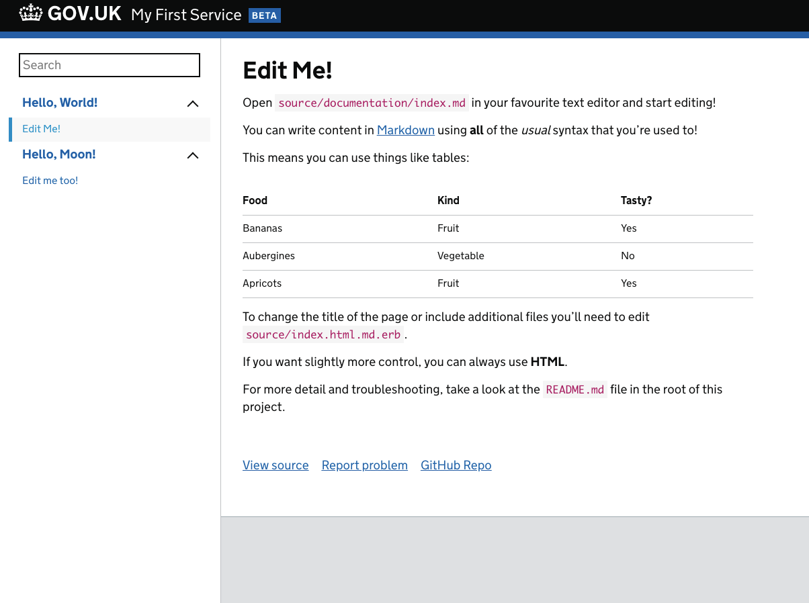

# Tech Docs Template

The Tech Docs Template is a [Middleman template][mmt] that
you can use to build technical documentation using a GOV.UK style.

This repo is the template used to generate new sites. The generated site uses HTML, CSS, JS and images from the [tech docs gem](https://github.com/alphagov/tech-docs-gem).

You’re welcome to use the template even if your service isn’t considered part of GOV.UK, but your site or service must not:

- identify itself as being part of GOV.UK
- use the crown or GOV.UK logotype in the header
- use the GDS Transport typeface
- suggest that it’s an official UK government website if it’s not

👉 To find out more about setting up and managing content for a website using this template, see the [Tech Docs Template documentation][tdt-docs].

## Before you start

To use the Tech Docs Template you need:

- [Ruby][install-ruby]
- [Middleman][install-middleman]

## Get started

To create a new project using the Tech Docs Template, run:

```sh
middleman init PROJECT_NAME -T alphagov/tech-docs-template
```

where `PROJECT_NAME` is the name of your new project.

This command creates a minimal functional website using the Tech Docs Template.

## Preview your website locally

To preview your new website locally, navigate to your project folder and run:

```sh
bundle exec middleman server
```

👉 See the generated website on `http://localhost:4567` in your browser. Any content changes you make to your website will be updated in real time.

To shut down the Middleman instance running on your machine, use `ctrl+C`.

If you make changes to the `config/tech-docs.yml` configuration file, you need to restart Middleman to see the changes.

## Configure your website

The `middleman init` command creates a minimal website with basic configuration.

You can change your website's configuration by editing the `config/tech-docs.yml` file.

👉 See what [configuration options][config] are available.

You can set page-specific options by editing the page's frontmatter.

👉 See how [frontmatter configuration options][frontmatter] are available.

## Adding content

You can add content by editing the `index.html.md.erb` file. These files support content in:

- Markdown
- HTML
- Ruby

👉 For example, you can use Markdown and HTML to [generate different content types][example-content] and [Ruby partials to manage content][partials].

Any file in the `source` folder ending in `.html.md.erb` produces a separate page for your website.

👉 Learn more about [producing more complex page structures][multipage] for your website.



## Publishing

To publish your website, you need to:

- build the HTML pages
- host your website
- decide how to push changes to your website

To build the HTML pages from content in your `source` folder, run:

```
bundle exec middleman build
```

Every time you run this command, the `build` folder gets generated from scratch. This means any changes to the `build` folder that are not part of the build command will get overwritten.

There are many options for hosting and pushing changes to your website, so it's worth considering user needs and constraints before making a choice.

## Troubleshooting

Run `bundle update` to make sure you're using the most recent Ruby gem versions.

Run `bundle exec middleman build --verbose` to get detailed error messages to help with finding the problem.

## Contribute

👉 See the [CONTRIBUTE.md file in the tech-docs-gem repository][contribute].

## Licence

Unless stated otherwise, the codebase is released under [the MIT License][mit].
This covers both the codebase and any sample code in the documentation.

The documentation is [© Crown copyright][copyright] and available under the terms of the [Open Government 3.0][ogl] licence.

[mit]: LICENCE
[copyright]: http://www.nationalarchives.gov.uk/information-management/re-using-public-sector-information/uk-government-licensing-framework/crown-copyright/
[ogl]: http://www.nationalarchives.gov.uk/doc/open-government-licence/version/3/
[mmt]: https://middlemanapp.com/advanced/project_templates/
[tdt-docs]: https://tdt-documentation.london.cloudapps.digital
[config]: https://tdt-documentation.london.cloudapps.digital/configuration-options.html#configuration-options
[frontmatter]: https://tdt-documentation.london.cloudapps.digital/frontmatter.html#frontmatter
[multipage]: https://tdt-documentation.london.cloudapps.digital/multipage.html#build-a-multipage-site
[example-content]: https://tdt-documentation.london.cloudapps.digital/content.html#content-examples
[partials]: https://tdt-documentation.london.cloudapps.digital/single_page.html#add-partial-lines
[contribute]: https://github.com/alphagov/tech-docs-gem/blob/master/CONTRIBUTING.md
[install-ruby]: https://tdt-documentation.london.cloudapps.digital/install_macs.html#install-ruby
[install-middleman]: https://tdt-documentation.london.cloudapps.digital/install_macs.html#install-middleman
